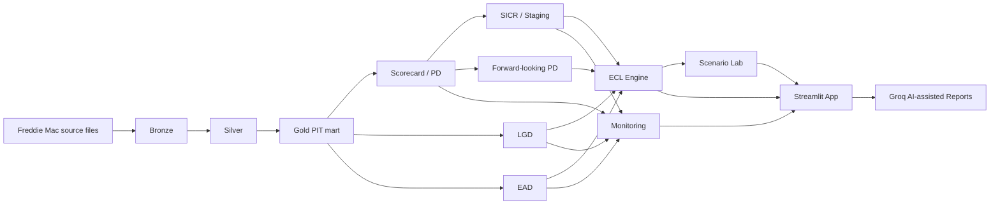

# IFRS 9 Credit Risk Engine

Professional portfolio/research project implementing a reproducible IFRS 9 credit risk and expected credit loss workflow in Python, with a Streamlit application for model review, scenario analysis, monitoring, and AI-assisted reporting.

This is not a regulatory production system. It is designed to demonstrate credit-risk engineering, model governance thinking, point-in-time controls, reproducible artifact generation, and deployment-safe presentation.

## Highlights

- Freddie Mac Source to Bronze ingestion and Bronze to Silver standardization.
- Gold point-in-time analytical mart with leakage-aware feature selection.
- Default definition, PD targets, temporal development sample factory, and logistic scorecards.
- Calibrated behavioural PD, lifetime PD, rating scale, transitions, and forward-looking PD scenarios.
- LGD, EAD, SICR/staging, ECL, Scenario Lab, monitoring, and Groq-backed report generation.
- Two application modes: `local_full` for research workflows and `cloud_demo` for public deployment.

## Architecture



## Data Source

The project is built around the Freddie Mac Single-Family Loan-Level Dataset. Source data is not included in this repository. Users must obtain it directly from Freddie Mac under the applicable terms of use:

https://www.freddiemac.com/research/datasets/sf-loanlevel-dataset

Local data zones are intentionally ignored by Git:

- `data/raw/`
- `data/bronze/`
- `data/silver/`
- `data/gold/`
- source ZIP/TXT files and Parquet loan-level artifacts

## Application Modes

Set the mode with `IFRS9_APP_MODE`.

### `local_full`

Default for local development. Supports full workflows where local data and artifacts exist:

- model training and recalibration;
- PD/LGD/EAD/SICR/ECL rebuilds;
- full Scenario Lab execution;
- local aggregate and loan-level artifacts.

### `cloud_demo`

Used for public Streamlit Community Cloud. Uses only compact aggregate artifacts under `deployment/` and does not require Freddie raw files, Bronze/Silver/Gold loan-level data, loan-level targets, staging, ECL snapshots, or scored rows.

In cloud mode, recalculation buttons are hidden or disabled with a clear message. Scenario Lab compares only packaged Baseline, Mild deterioration, and Severe deterioration aggregate results.

## Deployment Bundle

Build the public bundle with:

```bash
poetry run ifrs9 build-deployment-bundle
```

The bundle structure is:

```text
deployment/
├── manifest.json
├── portfolio/
├── scoring/
├── pd/
├── lgd/
├── ead/
├── sicr/
├── ecl/
├── scenarios/
└── monitoring/
```

The packaging step runs a safety audit and fails if prohibited loan-level files, absolute local paths, or secret-looking values are detected.

## Streamlit App

Launch locally:

```bash
poetry run streamlit run app/streamlit_app.py
```

Pages include:

- Overview
- Scoring Models
- PD
- LGD
- EAD
- SICR & Staging
- ECL
- Scenario Lab
- Model Monitoring
- Report Generator
- About / Methodology

## Groq AI-assisted Reporting

The Report Generator uses Groq Free Tier when configured:

```bash
GROQ_API_KEY=
ENABLE_LLM_REPORTING=true
```

Default model is configured in `config/reporting.yaml`:

```yaml
provider: groq
model: openai/gpt-oss-20b
reasoning_effort: low
max_output_tokens: 4000
```

The LLM never calculates PD, LGD, EAD, SICR, Stage, ECL, scenario results, or model metrics. It receives a compact `ReportContext` built from validated aggregate artifacts and returns structured narrative. Missing keys, rate limits, or provider failures fall back to deterministic template reporting.

## Local Setup

Install Poetry and dependencies with Python 3.11:

```bash
poetry install
```

Useful local commands:

```bash
poetry run ifrs9 ingest-freddie --all
poetry run ifrs9 build-silver --all
poetry run ifrs9 build-mart --all
poetry run ifrs9 build-targets --all
poetry run ifrs9 build-development-sample
poetry run ifrs9 train-scorecard --population behavioural
poetry run ifrs9 build-pd --scorecard-run behavioural_qe_v1
poetry run ifrs9 build-forward-looking --pd-run pd_behavioural_qe_v1
poetry run ifrs9 build-lgd
poetry run ifrs9 build-ead
poetry run ifrs9 build-staging
poetry run ifrs9 build-ecl
poetry run ifrs9 build-deployment-bundle
```

## Streamlit Community Cloud

Select Python 3.11 in Advanced Settings and configure secrets only in Streamlit Cloud:

```toml
GROQ_API_KEY=""
ENABLE_LLM_REPORTING=true
IFRS9_APP_MODE="cloud_demo"
```

Do not commit `.env` or `.streamlit/secrets.toml`.

## Testing

Run:

```bash
poetry check
poetry run ruff check .
poetry run pytest --cov=src/ifrs9
```

Historical strict `mypy` issues remain outside the deployment-critical path.

## Limitations

- This is a portfolio/research implementation, not a regulatory production platform.
- Freddie Mac public data does not include every contractual, servicing, or internal risk-management field used in production IFRS 9 systems.
- Baseline LGD is structural and macro-neutral in the ECL engine; rejected macro-LGD challengers remain documented.
- Stage 3 ECL uses an approximation where detailed default cashflow timing is unavailable.
- Monitoring thresholds are project thresholds, not regulatory limits.
